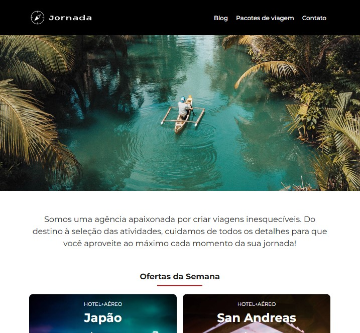

# Jornada Viagens - Alura

## 📝 Descrição

Este repositório contém o código de um projeto desenvolvido durante o curso de Front-end da **Alura**. O objetivo principal foi a construção de uma página web completa, simulando um cenário real de desenvolvimento, com foco em boas práticas de codificação e design adaptável.

## 🎯 Objetivos de Aprendizado

O projeto foi construído com o intuito de treinar e aplicar os seguintes conceitos:

- **HTML Semântico:** Utilização correta das tags HTML5 (`<header>`, `<main>`, `<section>`, `<footer>`, etc.) para garantir uma estrutura lógica, acessível e amigável para motores de busca (SEO).
- **Layout Responsivo:** Implementação de técnicas de CSS (como Media Queries) para assegurar que a página ofereça uma ótima experiência de usuário tanto em computadores (desktop) quanto em dispositivos móveis (celulares e tablets).
- **Modularização com CSS:** Organização e separação dos estilos para facilitar a manutenção, a leitura do código e o reaproveitamento de classes, evitando repetições desnecessárias.

## 🚀 Tecnologias Utilizadas

- **HTML5**
- **CSS3** (Flexbox/Grid, Variáveis CSS)

## 📂 Como executar o projeto

1.  Faça o download deste repositório ou clone-o utilizando o Git.
2.  Navegue até a pasta do projeto.
3.  Abra o arquivo `index.html` no seu navegador de preferência.

---

Desenvolvido durante a formação de Front-end da <a href="https://www.alura.com.br">Alura</a>.

